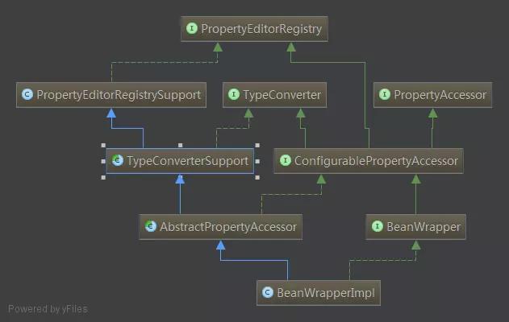

#### javaWeb模块  
SpringFrameWork:  
1.[Spring中的类型转换与校验](src/main/java/springframework/propertyeditorsupport/Spring中的类型转换与校验.MD)  
- PropertyEditor类型转换体系及源码分析及背后的工作流程
- Type Conversion,Formatter SPI转化体系的结构以及核心类的源码分析
- Spring的数据校验的工作机制以及源码分析校验的执行流程  
    
     
(Spring的类型转换系统在经历了版本升级变更之后，从3.0前的**PropertyEditor体系**转变到了3.0后的**Converter和Formatter转换体系**。)
参考链接：
* [深入分析Spring中的类型转换与校验](https://www.jianshu.com/p/e2baa8d87029)  
* [Spring conversion框架](https://blog.csdn.net/pentiumchen/article/details/44066173)  
* [深入分析Spring Type Conversion数据转换](https://blog.csdn.net/everyok/article/details/81350891)  